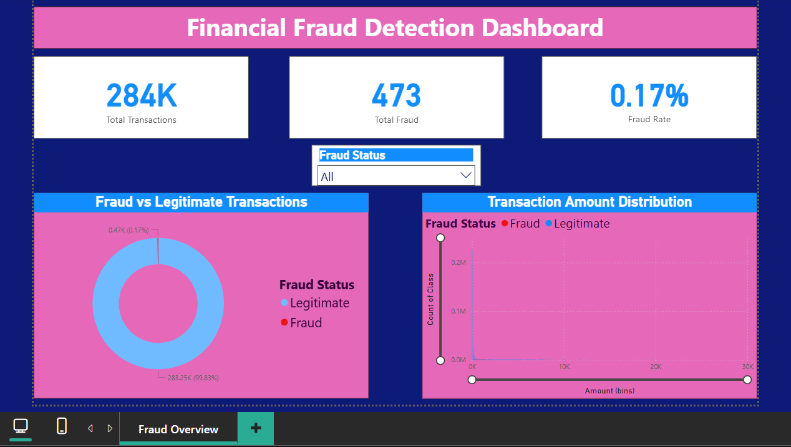

# Financial Fraud Detection - Machine Learning & Power BI Dashboard

## Project Overview
This project focuses on detecting fraudulent financial transactions using data analysis and machine learning techniques. The goal is to identify patterns in transaction data and build models capable of distinguishing fraudulent transactions from legitimate ones.

## Dataset
The dataset used in this project is the **Credit Card Fraud Detection dataset**.

Dataset source:
https://www.kaggle.com/datasets/mlg-ulb/creditcardfraud

The dataset contains transaction data including transaction amount, time, and anonymized features. Fraud transactions represent a very small percentage of total transactions, making this a highly imbalanced classification problem.

## Project Workflow
1. Data Cleaning and Preprocessing  
2. SQL Analysis using SQLite  
3. Exploratory Data Analysis (EDA)  
4. Feature Engineering  
5. Machine Learning Model Training  
6. Model Evaluation  
7. Power BI Dashboard Visualization  

## Machine Learning Models Used
- Logistic Regression
- Random Forest Classifier

## Evaluation Metrics
- Accuracy
- Confusion Matrix
- Classification Report

## Dashboard Preview

The Power BI dashboard highlights:

- Total Transactions
- Total Fraud Cases
- Fraud Rate
- Fraud vs Legitimate Transaction Distribution
- Transaction Amount Distribution

## Tools & Technologies
- Python
- Pandas
- NumPy
- SQL (SQLite)
- Scikit-learn
- Power BI
- Jupyter Notebook

## Key Insights
- Fraud transactions represent a very small percentage of total transactions.
- Random Forest performed slightly better in detecting fraud patterns.
- Machine learning models can assist financial institutions in identifying suspicious transactions.

## Project Files
- `fraud_detection_capstone.ipynb` – Data analysis and machine learning model
- `fraud_dashboard.png` – Power BI dashboard preview
- `project_synopsis.pdf` – Project synopsis
